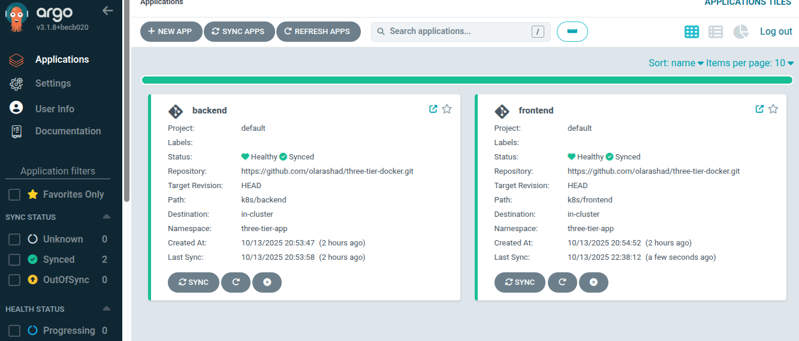
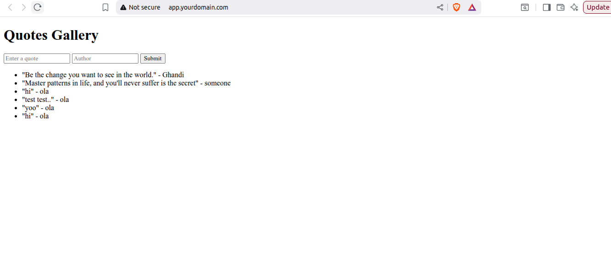

# Three-Tier Docker Application with Kubernetes Deployment & Continuous Delivery using ArgoCD

A production-ready three-tier web application deployed on Kubernetes with ArgoCD for continuous delivery. This project demonstrates containerization best practices, Kubernetes orchestration, and GitOps principles.

## Table of Contents

- [Architecture Overview](#architecture-overview)
- [Technology Stack](#technology-stack)
- [Project Structure](#project-structure)
- [Prerequisites](#prerequisites)
- [Docker Setup](#docker-setup)
- [Kubernetes Deployment](#kubernetes-deployment)
- [ArgoCD Integration](#argocd-integration)
- [Security Configuration](#security-configuration)
- [Local Development](#local-development)
- [Production Deployment](#production-deployment)
- [Monitoring and Maintenance](#monitoring-and-maintenance)
- [Troubleshooting](#troubleshooting)
- [Screen Shots](#screen-shots)
- [References](#references)

## Architecture Overview

This application follows a classic three-tier architecture pattern designed for scalability, maintainability, and high availability.

### Tier Breakdown

#### Tier 1: Presentation Layer (Frontend)
- Flask web app that renders HTML files
- Served via Nginx or similar web server
- Containerized with Docker (non-root user)
- Exposed via Kubernetes Ingress

#### Tier 2: Application Layer (Backend)
- Flask-based REST API (Python)
- Handles business logic and data processing
- Containerized with Docker (non-root user)
- Connects to external MySQL database
- Uses ConfigMaps and Secrets for database credentials

#### Tier 3: Data Layer (Database)
- MySQL database server
- Runs on dedicated Linux VM (external to Kubernetes)
- Alternative: MySQL Kubernetes Operator (advanced deployment)
- Connected securely from backend pods

## Technology Stack

| Category | Technology | Version | Purpose |
|----------|------------|---------|---------|
| **Frontend** | Flask | 2.3+ | Web framework |
| **Backend** | Flask RESTful | 0.3.10+ | REST API framework |
| **Database** | MySQL | 8.0+ | Primary data store |
| **Containerization** | Docker | 20.10+ | Application packaging |
| **Orchestration** | Kubernetes | 1.24+ | Container orchestration |
| **CI/CD** | ArgoCD | 2.8+ | GitOps continuous delivery |
| **Ingress** | NGINX | 1.9+ | Load balancing & routing |

## Project Structure

```
three-tier-app/
├── frontend/
│   ├── app.py                 # Main Flask application
│   ├── requirements.txt       # Python dependencies
│   ├── Dockerfile             # Frontend container definition
│   └── templates/            # HTML templates
│       ├── base.html
│       ├── index.html
│       └── error.html
│
├── backend/
│   ├── api.py                # REST API server
│   ├── requirements.txt      # Python dependencies
│   ├── Dockerfile            # Backend container definition
│   ├── config/              # Configuration files
│   │   └── config.py
│   ├── models/              # Database models
│   │   └── models.py
│   ├── routes/              # API endpoints
│   │   ├── auth.py
│   │   └── users.py
│   └── utils/               # Utility functions
│       └── db.py
│
├── k8s/
│   ├── namespace.yaml       # Kubernetes namespace
│   ├── backend/
│   │   ├── backend-deployment.yaml  # Backend deployment
│   │   ├── backend-service.yaml     # Backend service
│   │   ├── backend-configmap.yaml   # Backend configuration
│   │   ├── backend-ingress.yaml     # Backend ingress rules
│   │   └── backend-secret.yaml      # Backend secrets
│   │
│   ├── frontend/
│   │   ├── frontend_deployment.yaml  # Frontend deployment
│   │   ├── frontend_service.yaml     # Frontend service
│   │   ├── frontend_configmap.yaml   # Frontend configuration
│   │   ├── frontend_ingress.yaml     # Frontend ingress rules
│   │   └── frontend_secret.yaml      # Frontend secrets
│   │
│   └── ingress/
│       └── ingress.yaml     # Main ingress configuration
│
├── argocd/
│   ├── application.yaml     # ArgoCD application manifest
│   └── appproject.yaml      # ArgoCD project configuration
│
├── docker-compose.yml       # Local development setup
├── .gitignore
├── .dockerignore
└── README.md
```

## Prerequisites

### Required Software

- **Docker**: Version 20.10+ ([Installation Guide](https://docs.docker.com/get-docker/))
- **Kubernetes Cluster**: Version 1.24+ (Minikube, Kind, or cloud provider)
- **kubectl**: Kubernetes command-line tool ([Installation Guide](https://kubernetes.io/docs/tasks/tools/))
- **ArgoCD**: Version 2.0+ ([Installation Guide](https://argo-cd.readthedocs.io/en/stable/getting_started/))
- **MySQL Server**: 8.0+ running on Linux VM
- **Git**: For version control

### MySQL Database Setup

The MySQL database runs on a separate Linux VM and must be accessible from your Kubernetes cluster.

```bash
# On your MySQL VM
sudo apt update
sudo apt install mysql-server

# Secure MySQL installation
sudo mysql_secure_installation

# Create database and user
mysql -u root -p
```

```sql
CREATE DATABASE three_tier_app;
CREATE USER 'app_user'@'%' IDENTIFIED BY 'secure_password';
GRANT ALL PRIVILEGES ON three_tier_app.* TO 'app_user'@'%';
FLUSH PRIVILEGES;
```

Update MySQL configuration to allow remote connections:

```bash
sudo nano /etc/mysql/mysql.conf.d/mysqld.cnf
# Change bind-address to 0.0.0.0 or your K8s cluster IP range

sudo systemctl restart mysql
```

## Docker Setup

### Building Docker Images

Both frontend and backend images are configured to run as non-root users for enhanced security.

#### Frontend Image

The Frontend Dockerfile performs the following operations:
- Uses Python 3.11 slim base image for minimal size
- Sets up the working directory at `/app`
- Copies and installs Python dependencies from requirements.txt
- Copies the application source code
- Creates a non-root user (appuser) for security
- Switches to the non-root user context
- Exposes port 5002 for the Flask application
- Sets the command to run the Flask application

Build and push frontend image:

```bash
cd frontend
docker build -t your-registry/three-tier-frontend:v1.0 .
docker push your-registry/three-tier-frontend:v1.0
```

#### Backend Image

The Backend Dockerfile performs the following operations:
- Uses Python 3.11 slim base image
- Sets up the working directory at `/api`
- Installs system dependencies required for MySQL client connectivity
- Copies and installs Python dependencies including Flask and MySQL client libraries
- Copies the application source code
- Creates a non-root user (flaskuser) for enhanced security
- Switches to the non-root user context
- Exposes port 5001 for the API server
- Sets the command to run the API server

Build and push backend image:

```bash
cd backend
docker build -t your-registry/three-tier-backend:v1.0 .
docker push your-registry/three-tier-backend:v1.0
```

## Kubernetes Deployment

### 1. Create Namespace

```bash
kubectl create namespace three-tier-app
```

### 2. Create Secrets for Database Credentials

```bash
kubectl create secret generic db-credentials \
  --from-literal=DB_HOST=your_ip \
  --from-literal=DB_USER=app_user \
  --from-literal=DB_PASSWORD=secure_password \
  --from-literal=DB_NAME=three_tier_app \
  -n three-tier-app
```

### 3. Backend YAML Files

Deploy the backend components:
- `k8s/backend/backend-deployment.yaml` - Defines the backend pod specifications and replicas
- `k8s/backend/backend-service.yaml` - Exposes the backend pods internally
- `k8s/backend/backend-configmap.yaml` - Stores backend configuration data
- `k8s/backend/backend-ingress.yaml` - Configures external access rules for backend
- `k8s/backend/backend-secret.yaml` - Stores sensitive backend data

### 4. Frontend YAML Files

Deploy the frontend components:
- `k8s/frontend/frontend_configmap.yaml` - Stores frontend configuration data
- `k8s/frontend/frontend_deployment.yaml` - Defines the frontend pod specifications
- `k8s/frontend/frontend_ingress.yaml` - Configures external access rules for frontend
- `k8s/frontend/frontend_secret.yaml` - Stores sensitive frontend data
- `k8s/frontend/frontend_service.yaml` - Exposes the frontend pods

## ArgoCD Integration

ArgoCD provides GitOps-based continuous delivery for the application. Once installed and configured, ArgoCD will:

- Monitor the Git repository for changes
- Automatically sync Kubernetes manifests with the cluster
- Provide a web UI for visualizing application state
- Enable rollback capabilities
- Support automated sync policies

### Configure ArgoCD Application

Create the ArgoCD application manifest that points to your Git repository containing the Kubernetes manifests. The application will continuously monitor the repository and apply changes automatically based on the sync policy defined.

```bash
kubectl create namespace argocd
kubectl apply -n argocd -f https://raw.githubusercontent.com/argoproj/argo-cd/stable/manifests/install.yaml

# Wait for ArgoCD to be ready
kubectl wait --for=condition=ready pod -l app.kubernetes.io/name=argocd-server -n argocd --timeout=300s

# Get admin password
kubectl -n argocd get secret argocd-initial-admin-secret -o jsonpath="{.data.password}" | base64 -d
```

## Security Configuration

Security measures implemented in this deployment include:

- **Non-root containers**: All containers run as non-root users
- **Resource limits**: CPU and memory limits prevent resource exhaustion
- **Network policies**: Restrict traffic between pods
- **Secrets management**: Sensitive data stored in Kubernetes secrets
- **TLS/SSL**: Encrypted communication for ingress traffic
- **RBAC**: Role-based access control for Kubernetes resources

## Local Development

### Using Docker Compose

For local testing before Kubernetes deployment, use the provided `docker-compose.yml` file which sets up:

- Frontend service on port 5002
- Backend service on port 5001
- Network connectivity between services
- Environment variable configuration
- Volume mounts for development

```bash
docker-compose up -d
```

## Production Deployment

### Complete Deployment Steps

1. **Prepare your Kubernetes cluster**
   - Ensure cluster is running and accessible
   - Install necessary ingress controllers
   - Configure DNS settings

2. **Deploy all Kubernetes resources**
   - Apply namespace and secrets
   - Deploy backend components
   - Deploy frontend components
   - Configure ingress rules

3. **Verify deployments**
   - Check pod status and logs
   - Verify service endpoints
   - Test ingress connectivity

4. **Check pod status**
   ```bash
   kubectl get pods -n three-tier-app
   kubectl describe pods -n three-tier-app
   ```

5. **Test the application**
   - Access the application through the configured ingress URL
   - Verify frontend-backend communication
   - Test database connectivity

## Monitoring and Maintenance

### 1. View Application Logs

```bash
# View frontend logs
kubectl logs -f deployment/frontend -n three-tier-app

# View backend logs
kubectl logs -f deployment/backend -n three-tier-app
```

### 2. Scale Deployments

```bash
# Scale frontend
kubectl scale deployment frontend --replicas=5 -n three-tier-app

# Scale backend
kubectl scale deployment backend --replicas=5 -n three-tier-app
```

### 3. Update Application

With ArgoCD, simply push changes to your Git repository. ArgoCD will automatically detect and apply the changes based on your sync policy.

## Troubleshooting

### Common Issues

**1. Pods not starting**
- Check pod events: `kubectl describe pod <pod-name> -n three-tier-app`
- Verify image pull secrets
- Check resource limits

**2. Database connection issues**
- Verify database credentials in secrets
- Check network connectivity from pods
- Ensure MySQL is configured for remote connections

**3. Image pull errors**
- Verify registry credentials
- Check image name and tag
- Ensure registry is accessible from cluster

**4. SCC/Security issues**
- Verify security context settings
- Check pod security policies
- Review RBAC permissions

**5. Health Checks**
- Verify health check endpoints are implemented
- Check probe configuration in deployments
- Review application logs for errors

## Screen Shots

### 1. ArgoCD UI – Deployed Applications


### 2. Frontend Application – Running in Browser


## References

- Original application source: [pdichone/docker-course-three-tier-web-app](https://github.com/pdichone/docker-course-three-tier-web-app)
